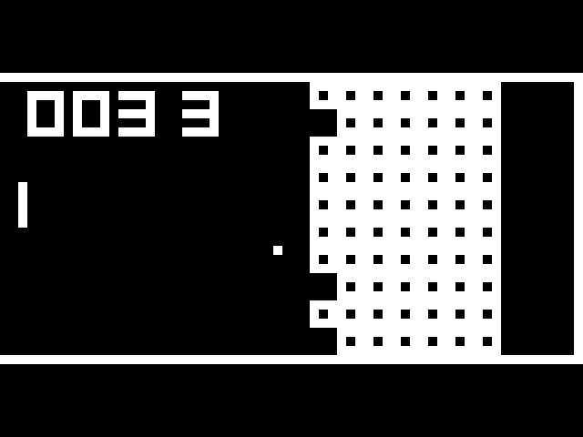
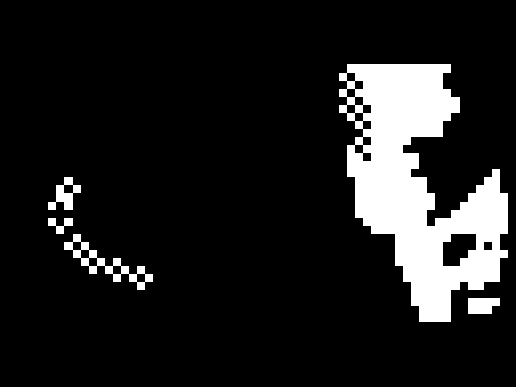

Yet another ruby chip8 emulator

from: https://github.com/alexanderdickson/Chip-8-Emulator/blob/master/roms/VBRIX

from: https://github.com/dmatlack/chip8/blob/master/roms/demos/Trip8%20Demo%20(2008)%20%5BRevival%20Studios%5D.txt

from: https://steveroll.itch.io/chip-8-snake

##############

To run:

##############

Must have ruby (3.x) installed (https://github.com/rbenv/rbenv)

1. clone the repo
git clone https://github.com/sixthkrum/yarce

2. install dependencies for ruby2d: (https://www.ruby2d.com/learn/linux/#install-packages)

3. install gems by running this command inside the cloned repo
cd yarce
bundle install

4. to run a game do the following in the root directory of the project clone:

./src/main.rb $ROM_FILE_PATH

where $ROM_FILE_PATH is a path to a chip8 rom

##############

Currently only fully supports Chip8

Control scheme:

keyboard <=> chip8

1 2 3 4  <=> 0 1 2 3

q w e r  <=> 4 5 6 7

a s d f  <=> 8 9 A B

z x c v  <=> C D E F

press 'escape' to close the window

##############

broad goals:

1. make it easy to implement new instructions as needed
2. decouple frame creation and rendering (keep a framebuffer and only load frames at a fixed configurable(maybe) rate)
3. keep screen drawing and input directives seperate from the core implementation to allow for more extensibility
4. make the component definition more generic (registers etc.)

stretch goals: (in no particular order)
1. make it work with natalie
2. make it easily distributable
